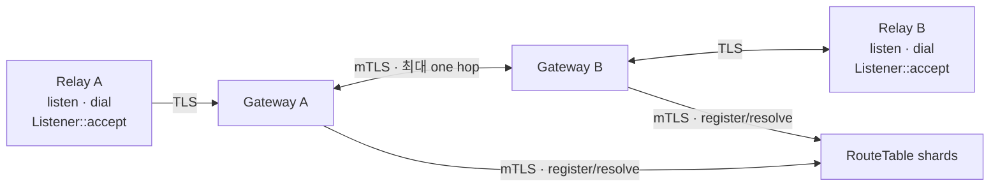

# RelayGate

NAT 뒤 애플리케이션이 outbound session 하나로 Destination을 수신하고 다른 Destination으로 양방향 byte stream을
여는 Rust relay입니다.



```text
Destination -> live Binding 0..N
dial 1회     -> Binding 1개 -> opaque bidirectional Pipe 1개
```

## 책임

| RelayGate | Application |
| --- | --- |
| TLS session과 PUBLISH/DIAL JWT grant 검증 | Destination·token 발급 정책 |
| live Binding 조회와 local/one-hop Pipe | Pipe 상대 인증·인가 |
| bounded queue, timeout, heartbeat, cleanup | payload framing·의미·acknowledgement·retry |
| SDK reconnect와 Listener republish | 필요한 E2E payload 보호 |

RouteTable은 memory-only current state를 유지합니다. 새 연결은 새 `dial`로 시작하며 기존 Pipe와 payload의
수명은 해당 Pipe와 application이 소유합니다.

## Rust SDK

```rust,no_run
use relaygate_sdk::{AccessToken, AccessTokenSource, Config, Destination, Relay, ResourceLimits};

# async fn example() -> Result<(), Box<dyn std::error::Error>> {
let gateway_host = std::env::var("RELAYGATE_GATEWAY_HOST")?;
let limits = ResourceLimits::default()
    .with_max_live_pipes_per_listener(1_000)
    .with_max_live_pipes_per_relay(2_000);
let config = Config::new(format!("{gateway_host}:443"))?.with_resource_limits(limits);
let relay = Relay::connect(config).await?;

let destination: Destination = "inference/stt.seoul".parse()?;
let token = AccessToken::new(std::env::var("RELAYGATE_ACCESS_TOKEN")?)?;
let listener = relay
    .listen(destination.clone(), AccessTokenSource::static_token(token))
    .await?;

// 다른 Relay: relay.dial(destination, its_token_source).await?;
let mut incoming = listener.accept().await?;
# let _ = &mut incoming;
# Ok(())
# }
```

공인 인증서는 endpoint의 도메인과 기본 CA 목록으로 자동 검증합니다. 사설 CA는
`Config::with_ca_certificate(pem)`으로 지정합니다. `tcp://host:port`는 제공자가 명시적으로
노출한 평문 endpoint이며 access token과 payload도 암호화되지 않습니다. Gateway는
`RELAYGATE_SDK_TRANSPORT=plaintext`로 선택하며 기본값은 `tls`입니다. TLS 실패 시 평문으로 전환하지 않습니다.
session loss 뒤
SDK는 jitter가 포함된 bounded backoff로 재연결하고 live Listener를 새 Binding으로 등록합니다.

고급 transport는 `Config::with_transport(transport)`를 사용합니다. CA·인증서 검증 이름·클라이언트 인증은
`ClientTlsConfig`에서 함께 설정하며 `with_ca_certificate`로 덮어쓰지 않습니다.

## Token 발급 helper

Backend는 호출자를 인증하고 operation을 허가한 뒤 server-side helper로 JWT를 생성합니다.

```rust,no_run
use std::time::Duration;

use relaygate_destination::Destination;
use relaygate_token_issuer::{Action, TokenIssuer};

# fn example() -> Result<(), Box<dyn std::error::Error>> {
let private_key = std::fs::read("/run/secrets/relaygate-issuer.pem")?;
let issuer = TokenIssuer::from_es256_pem(
    "https://issuer.example",
    "relaygate",
    "issuer-key-v1",
    private_key,
)?;
let destination: Destination = "inference/stt.seoul".parse()?;

// Application authorization must succeed before this call.
let token = issuer.issue_exact(Action::Dial, &destination, Duration::from_secs(300))?;
# let _ = token;
# Ok(())
# }
```

Helper는 unencrypted P-256 PKCS#8 PEM을 읽고 canonical header·claim을 생성합니다. 로그인, permission 정책,
HTTP endpoint, key 보관·회전과 token cache는 application backend가 소유합니다.

## 검증

| 범위 | 명령 |
| --- | --- |
| Rust compile/test | `cargo fmt --all --check && cargo check --workspace && cargo test --workspace` |
| Rust lint | `cargo clippy --workspace --all-targets --all-features -- -D warnings` |
| RT2/GW3 Compose | `docker compose up --build --abort-on-container-exit --exit-code-from topology-probe` |
| observability | `docker compose --profile observability up --build --abort-on-container-exit --exit-code-from observability-probe observability-probe` |
| 연결 후 DATA RTT | topology 실행 중 `docker compose run --rm --no-deps topology-probe relaygate-echo-probe latency` |
| isolated Kubernetes | `tests/kind/run.sh` |

Compose 종료:

```bash
docker compose --profile observability down --volumes --remove-orphans
```

## 의존성 업데이트

[Dependabot 설정](.github/dependabot.yml)은 매주 월요일 03:23 KST에 Cargo·GitHub Actions·Docker base image 신버전을 확인합니다.

- Cargo 패치 업데이트는 묶고, 마이너·메이저 업데이트는 별도 PR로 제안합니다. 동시에 열린 일반 업데이트 PR은 최대 3개입니다.
- GitHub Actions와 `deploy/docker/Dockerfile`은 각각 마이너·패치를 묶고 메이저는 별도 PR로 제안합니다. 각각 최대 1개씩 열어 일반 업데이트 PR은 전체 최대 5개입니다.
- 외부 Action은 full commit SHA로 고정하며 Dependabot이 이후 SHA 업데이트를 제안합니다.
- Cargo 직접 의존성과 `Cargo.lock`에 기록된 전이 의존성을 모두 확인합니다.
- `relaygate-*` 자체 버전과 `tests/package-consumer`의 릴리즈 검증용 고정 버전은 제외합니다.
- 취약점 수정 PR은 기존 Dependabot security updates가 별도로 생성합니다.

실행 상태와 수동 확인은 저장소의 `Insights → Dependency graph → Dependabot`에서 확인합니다.
PR은 기존 CI로 검증하고 직접 머지합니다. 릴리즈 버전 변경과 배포는 기존 절차를 따릅니다.

## crates.io 릴리즈 재실행

[Release crates](.github/workflows/release-crates.yml)는 현재 main의 workspace 버전과
`publish-<version>` 확인을 받은 후 기존 package 검증을 수행합니다.
일부 crate만 배포된 상태에서 실패해도 같은 버전으로 다시 실행할 수 있습니다.

- 이미 배포된 모든 crate의 registry checksum을 확인하고 현재 소스로 만든 package와 파일별로 비교합니다.
- `.cargo_vcs_info.json`의 `git.sha1`만 비교에서 제외합니다. 소스·manifest·lockfile 등 다른 내용이 다르거나
  버전이 yanked 상태이면 새 배포 전에 실패합니다. 내용이 달라졌다면 새 버전이 필요합니다.
- 일치하는 crate는 건너뛰고 미배포 crate만 의존성 순서대로 배포하며 crates.io index 반영을 기다립니다.
- 깨끗한 checkout에서 `python3 .github/scripts/release_crates.py`로 배포 없이 사전 검사를 실행할 수 있습니다.
  실제 업로드는 workflow가 전달하는 `--publish` 옵션이 있을 때만 수행합니다.

## 릴리즈 이미지 취약점 보고서

[Released image security](.github/workflows/security-rescan.yml)는 매일 03:23 KST에 GHCR의
`relaygate-gateway:latest`와 `relaygate-route-table:latest`를 Trivy로 검사합니다.
각 이미지의 index digest를 한 번 확인하고, 그 안의 Linux amd64·arm64 digest를 검사 대상으로 고정합니다.
이는 최신 릴리즈 검사이며 현재 production에 배포된 이미지와 일치하는지는 확인하지 않습니다.

- `HIGH`와 `CRITICAL`을 수정 버전 유무와 관계없이 보고합니다. 취약점 발견으로 작업을 실패시키지 않습니다.
- 검사 자체가 실패하면 별도 보안 workflow가 실패합니다. 기존 PR·빌드·릴리즈·배포와 연결된 gate는 없습니다.
- `Security → Code scanning`과 Actions 실행 요약에서 결과를 확인합니다. JSON·SARIF·텍스트 결과와
  검사 digest·Trivy 버전은 실행 artifact에 30일 보관합니다. Security 업로드 실패 시 artifact로 확인합니다.
- 수동 실행은 `Actions → Released image security → Run workflow`를 사용합니다. Cron은 기본 브랜치에서
  실행되며 GitHub의 실행 대기 상황에 따라 늦어질 수 있습니다.
- 공개 GHCR 이미지를 읽으므로 registry secret이나 production credential이 필요하지 않습니다.
  Trivy Action의 DB cache를 사용하며 매 실행 시 DB 갱신을 확인합니다.

현재 이미지는 일반 Rust 바이너리만 포함하므로 내장 crate의 Trivy 탐지 범위는 제한됩니다.
[Trivy의 compiled Rust 검사](https://trivy.dev/docs/latest/coverage/language/rust/)에는
`cargo-auditable` metadata가 필요합니다. 현재 보고서의 OS package 검사와 Dependabot의 source dependency
검사를 함께 사용하며, 바이너리 metadata 추가는 추후 build 변경으로 검토합니다.
취약점 예외는 현재 없습니다. 예외가 필요하면 finding ID·근거·만료일을 기록하고 검토합니다.

## Helm

차트는 RouteTable과 Gateway를 배포하며 credential과 certificate는 release namespace의 Secret을
사용합니다. 기본 topology는 RT shard 1개와 Gateway 1개입니다.
운영 이미지는 Distroless `cc-debian13`을 기반으로 하며 UID/GID `10001:10001`로 실행합니다.
이미지 안에 shell이 없으므로 점검은 `relaygate-server check`를 직접 실행합니다.

SDK edge는 TLS를 사용합니다. 내부 전송은 기본 mTLS이며, 격리된 테스트 환경은
`tls.internal.mode=plaintext`로 내부 인증서 없이 설치합니다.
인증서 발급·갱신·재시작은 배포자가 관리하며 차트에는 기존 Secret 이름과 운영 annotation을 전달합니다.

```bash
helm lint deploy/helm/relaygate
helm template relaygate deploy/helm/relaygate --kube-version 1.32.0
```

설치와 rotation 절차는 [Helm chart README](deploy/helm/relaygate/README.md)를 따릅니다.

## 구조

```text
crates/
├── relaygate-destination/           Destination grammar
├── relaygate-protocol/              SDK-GW wire
├── relaygate-transport/             TLS/mTLS adapter
├── relaygate-sdk/                   public Relay, Listener, Pipe API
├── relaygate-token-issuer/          server-side operation JWT helper
├── relaygate-gateway/               Binding, dial, relay, cleanup
├── relaygate-gateway-peer/          GW-GW one-hop transport, handshake, peer wire
├── relaygate-gateway-routing/       RT registration, KeepAlive, Resolve orchestration
├── relaygate-route-table/           memory-only current-state shard
├── relaygate-route-table-transport/ GW-RT bounded transport/auth
└── relaygate-server/                config, wiring, metrics, shutdown
```

[문서 지도](docs/)에서 ADR, SPEC, TEST와 RFC 근거를 확인할 수 있습니다.
