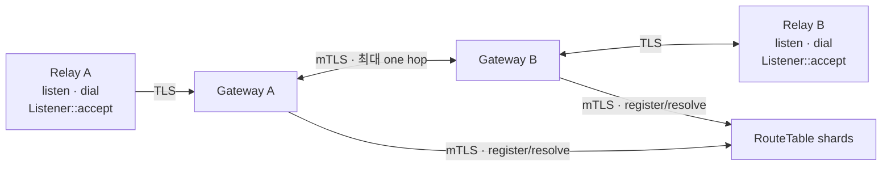

# RelayGate

NAT 뒤 애플리케이션이 outbound session 하나로 Destination을 수신하고 다른 Destination으로 양방향 byte stream을
여는 Rust relay입니다.



```text
Destination -> live Binding 0..N
dial 1회     -> Binding 1개 -> opaque bidirectional Pipe 1개
```

## 책임

| RelayGate | Application |
| --- | --- |
| TLS session과 PUBLISH/DIAL JWT grant 검증 | Destination·token 발급 정책 |
| live Binding 조회와 local/one-hop Pipe | Pipe 상대 인증·인가 |
| bounded queue, timeout, heartbeat, cleanup | payload framing·의미·acknowledgement·retry |
| SDK reconnect와 Listener republish | 필요한 E2E payload 보호 |

RouteTable은 memory-only current state를 유지합니다. 새 연결은 새 `dial`로 시작하며 기존 Pipe와 payload의
수명은 해당 Pipe와 application이 소유합니다.

## Rust SDK

```rust,no_run
use relaygate_sdk::{AccessToken, AccessTokenSource, Config, Destination, Relay, ResourceLimits};

# async fn example() -> Result<(), Box<dyn std::error::Error>> {
let gateway_host = std::env::var("RELAYGATE_GATEWAY_HOST")?;
let limits = ResourceLimits::default()
    .with_max_live_pipes_per_listener(1_000)
    .with_max_live_pipes_per_relay(2_000);
let config = Config::new(format!("{gateway_host}:443"))?.with_resource_limits(limits);
let relay = Relay::connect(config).await?;

let destination: Destination = "inference/stt.seoul".parse()?;
let token = AccessToken::new(std::env::var("RELAYGATE_ACCESS_TOKEN")?)?;
let listener = relay
    .listen(destination.clone(), AccessTokenSource::static_token(token))
    .await?;

// 다른 Relay: relay.dial(destination, its_token_source).await?;
let mut incoming = listener.accept().await?;
# let _ = &mut incoming;
# Ok(())
# }
```

공인 인증서는 endpoint의 도메인과 기본 CA 목록으로 자동 검증합니다. 사설 CA는
`Config::with_ca_certificate(pem)`으로 지정합니다. `tcp://host:port`는 제공자가 명시적으로
노출한 평문 endpoint이며 access token과 payload도 암호화되지 않습니다. Gateway는
`RELAYGATE_SDK_TRANSPORT=plaintext`로 선택하며 기본값은 `tls`입니다. TLS 실패 시 평문으로 전환하지 않습니다.
session loss 뒤
SDK는 jitter가 포함된 bounded backoff로 재연결하고 live Listener를 새 Binding으로 등록합니다.

고급 transport는 `Config::with_transport(transport)`를 사용합니다. CA·인증서 검증 이름·클라이언트 인증은
`ClientTlsConfig`에서 함께 설정하며 `with_ca_certificate`로 덮어쓰지 않습니다.

## Token 발급 helper

Backend는 호출자를 인증하고 operation을 허가한 뒤 server-side helper로 JWT를 생성합니다.

```rust,no_run
use std::time::Duration;

use relaygate_destination::Destination;
use relaygate_token_issuer::{Action, TokenIssuer};

# fn example() -> Result<(), Box<dyn std::error::Error>> {
let private_key = std::fs::read("/run/secrets/relaygate-issuer.pem")?;
let issuer = TokenIssuer::from_es256_pem(
    "https://issuer.example",
    "relaygate",
    "issuer-key-v1",
    private_key,
)?;
let destination: Destination = "inference/stt.seoul".parse()?;

// Application authorization must succeed before this call.
let token = issuer.issue_exact(Action::Dial, &destination, Duration::from_secs(300))?;
# let _ = token;
# Ok(())
# }
```

Helper는 unencrypted P-256 PKCS#8 PEM을 읽고 canonical header·claim을 생성합니다. 로그인, permission 정책,
HTTP endpoint, key 보관·회전과 token cache는 application backend가 소유합니다.

## 검증

| 범위 | 명령 |
| --- | --- |
| Rust compile/test | `cargo fmt --all --check && cargo check --workspace && cargo test --workspace` |
| Rust lint | `cargo clippy --workspace --all-targets --all-features -- -D warnings` |
| RT2/GW3 Compose | `docker compose up --build --abort-on-container-exit --exit-code-from topology-probe` |
| observability | `docker compose --profile observability up --build --abort-on-container-exit --exit-code-from observability-probe observability-probe` |
| 연결 후 DATA RTT | topology 실행 중 `docker compose run --rm --no-deps topology-probe relaygate-echo-probe latency` |
| isolated Kubernetes | `tests/kind/run.sh` |

Compose 종료:

```bash
docker compose --profile observability down --volumes --remove-orphans
```

## 의존성 업데이트

[Renovate workflow](.github/workflows/renovate.yml)는 매주 월요일 03:23 KST에 실행되며,
GitHub Actions의 `Run workflow`로 즉시 실행할 수도 있습니다. 정책은 [renovate.json](renovate.json)에 둡니다.

- Cargo 패치 업데이트는 묶고, 마이너·메이저 업데이트는 별도 PR로 제안합니다. 동시에 열린 PR은 최대 3개입니다.
- `Cargo.lock` 유지보수 PR은 현재 manifest 범위 안에서 전이 의존성을 포함한 잠금 버전을 갱신합니다.
- `relaygate-*` 자체 버전과 `tests/package-consumer`의 릴리즈 검증용 고정 버전은 제외합니다.
- 취약점 수정 PR은 기존 Dependabot security updates가 담당합니다.

Renovate는 저장소의 `GITHUB_TOKEN`을 사용합니다. 저장소 Actions 설정에서
`Allow GitHub Actions to create and approve pull requests`가 켜져 있어야 하며,
생성된 PR의 CI는 쓰기 권한이 있는 사용자가 `Approve workflows to run`을 눌러 시작합니다.
자동 머지는 꺼져 있고, 머지 후 릴리즈 버전 변경과 배포는 기존 절차를 따릅니다.

## Helm

차트는 RouteTable과 Gateway를 배포하며 credential과 certificate는 release namespace의 Secret을
사용합니다. 기본 topology는 RT shard 1개와 Gateway 1개입니다.

SDK edge는 TLS를 사용합니다. 내부 전송은 기본 mTLS이며, 격리된 테스트 환경은
`tls.internal.mode=plaintext`로 내부 인증서 없이 설치합니다.
인증서 발급·갱신·재시작은 배포자가 관리하며 차트에는 기존 Secret 이름과 운영 annotation을 전달합니다.

```bash
helm lint deploy/helm/relaygate
helm template relaygate deploy/helm/relaygate --kube-version 1.32.0
```

설치와 rotation 절차는 [Helm chart README](deploy/helm/relaygate/README.md)를 따릅니다.

## 구조

```text
crates/
├── relaygate-destination/           Destination grammar
├── relaygate-protocol/              SDK-GW wire
├── relaygate-transport/             TLS/mTLS adapter
├── relaygate-sdk/                   public Relay, Listener, Pipe API
├── relaygate-token-issuer/          server-side operation JWT helper
├── relaygate-gateway/               Binding, dial, relay, cleanup
├── relaygate-gateway-peer/          GW-GW one-hop transport, handshake, peer wire
├── relaygate-gateway-routing/       RT registration, KeepAlive, Resolve orchestration
├── relaygate-route-table/           memory-only current-state shard
├── relaygate-route-table-transport/ GW-RT bounded transport/auth
└── relaygate-server/                config, wiring, metrics, shutdown
```

[문서 지도](docs/)에서 ADR, SPEC, TEST와 RFC 근거를 확인할 수 있습니다.
